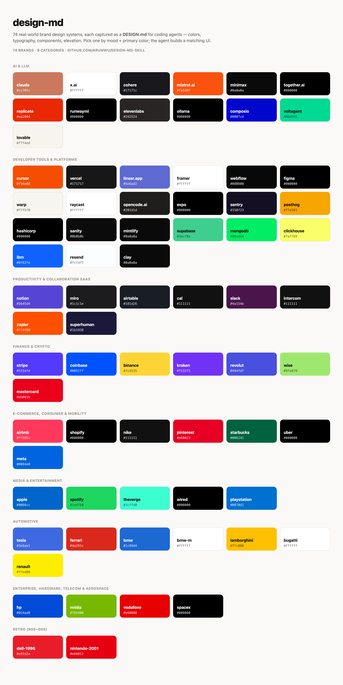

# design-md

**A Claude / agent skill that turns 74 real-world brand design systems into a pick-and-build reference library.**

Ask your coding agent for a UI *"like Linear"*, *"with an Apple vibe"*, or *"feel like Stripe"* — this skill gives it a curated index of 74 brands (primary color + one-line character each) and points it at a matching `DESIGN.md` full of real color roles, type scales, component rules, and elevation. The agent stops inventing palettes and starts building from a coherent, real design system.



Works with **Claude Code**, the **Claude Agent SDK**, **OpenClaw**, or any agent runtime that loads `SKILL.md`-style skills.

> Design content comes from [**voltagent/awesome-design-md**](https://github.com/voltagent/awesome-design-md) (MIT). This repo is a thin **index + workflow** layer on top of it.

---

## Why

Coding agents are great at layout and terrible at taste-by-default — left alone they reach for the same generic gradient-on-slate look. Handing an agent a single real `DESIGN.md` fixes that instantly, but you first have to *know which one to grab*. This skill solves the picking problem: a compact, categorized index the agent can scan by **mood + primary color** in one pass, then load the full design system for the winner.

## What's inside

- **`SKILL.md`** — the skill itself: trigger description, workflow, and the full **74-brand index** (each with its primary color and a one-line style descriptor).
- The actual design systems (`DESIGN.md` + `preview.html` + `preview-dark.html` per brand) live in [voltagent/awesome-design-md](https://github.com/voltagent/awesome-design-md); the skill locates or clones that library on demand.

### The 74 brands, by category

| Category | Count | Examples |
|---|---:|---|
| AI & LLM | 13 | claude · x.ai · cohere · mistral.ai · runwayml |
| Developer tools & platforms | 21 | cursor · vercel · linear.app · figma · supabase |
| Productivity & collaboration | 8 | notion · slack · miro · intercom · zapier |
| Finance & crypto | 7 | stripe · coinbase · binance · kraken · wise |
| E-commerce, consumer & mobility | 7 | airbnb · shopify · nike · uber · pinterest |
| Media & entertainment | 5 | apple · spotify · wired · theverge · playstation |
| Automotive | 7 | tesla · ferrari · bmw-m · lamborghini · bugatti |
| Enterprise / hardware / telecom / aerospace | 4 | nvidia · hp · vodafone · spacex |
| Retro (90s–00s) | 2 | dell-1996 · nintendo-2001 |

👉 **Full index with colors and descriptions: [`SKILL.md`](./SKILL.md).**

---

## Install

### Claude Code

```bash
mkdir -p ~/.claude/skills/design-md
curl -fsSL https://raw.githubusercontent.com/arumwu/design-md-skill/main/SKILL.md \
  -o ~/.claude/skills/design-md/SKILL.md
```

Or clone and copy:

```bash
git clone https://github.com/arumwu/design-md-skill.git
mkdir -p ~/.claude/skills/design-md
cp design-md-skill/SKILL.md ~/.claude/skills/design-md/SKILL.md
```

### OpenClaw (global — shared by all agents)

```bash
mkdir -p ~/.agents/skills/design-md
cp design-md-skill/SKILL.md ~/.agents/skills/design-md/SKILL.md
```

Restart the agent session so it picks up the new skill (skills are snapshotted at session start).

### Any other agent runtime

Drop `SKILL.md` wherever your runtime discovers skills. It's a single self-contained file.

### Get the design library

The skill reads brand files from a local clone of awesome-design-md. Clone it once:

```bash
git clone --depth 1 https://github.com/voltagent/awesome-design-md.git ~/Developer/awesome-design-md
```

The skill auto-resolves the library from `DESIGN_MD_DIR`, then common locations
(`~/Developer/awesome-design-md`, `~/dev/awesome-design-md`, `~/awesome-design-md`,
or an `awesome-design-md/` folder in the project), and offers to clone it if missing.

---

## Usage

Once installed, just describe what you want in brand terms:

> "Build a pricing page that feels like **Linear**."
> "Landing hero with a **Stripe** vibe — the mesh gradient and all."
> "Give this dashboard an **Apple** museum-gallery feel."

The agent will:

1. **Pick a brand** from the index by mood + primary color.
2. **Load** `<library>/design-md/<brand>/DESIGN.md`.
3. **Build** using its color roles, type scale, components, and elevation as a hard spec.
4. *(optional)* Hand off to `frontend-design` → `tailwind-design-system` → `shadcn` → `design-review`.

You can also just open the index in `SKILL.md` yourself and name the brand directly.

---

## 快速開始（繁體中文 Quick Start）

**1. 安裝 skill**

Claude Code：

```bash
mkdir -p ~/.claude/skills/design-md
curl -fsSL https://raw.githubusercontent.com/arumwu/design-md-skill/main/SKILL.md \
  -o ~/.claude/skills/design-md/SKILL.md
```

OpenClaw（全域，所有 agent 共用）：

```bash
mkdir -p ~/.agents/skills/design-md
cp design-md-skill/SKILL.md ~/.agents/skills/design-md/SKILL.md
```

> OpenClaw 要**重啟 agent session** 才會吃到新 skill（skills 在 session 起始 snapshot）。

**2. Clone 設計庫一次**

```bash
git clone --depth 1 https://github.com/voltagent/awesome-design-md.git ~/Developer/awesome-design-md
```

**3. 用品牌語言下指令**

> 「做一個像 **Linear** 風格的 pricing page。」
> 「Landing hero 給我 **Stripe** 那種 mesh 漸層感。」
> 「這個 dashboard 走 **Apple** 博物館畫廊的調性。」

Agent 會自動：挑品牌 → 讀 `<library>/design-md/<品牌>/DESIGN.md` → 照色票/字級/元件/陰影當硬規格生成 → （選用）接 `frontend-design` → `tailwind-design-system` → `shadcn` → `design-review` 落地。

不確定挑哪個？直接看 [`SKILL.md`](./SKILL.md) 的 74 品牌索引（主色 + 一句話），或參考文末的挑選提示。

---

## How it works

```
your prompt ──▶ design-md skill (index in SKILL.md)
                     │  pick brand by mood + primary color
                     ▼
        <library>/design-md/<brand>/DESIGN.md   ◀── voltagent/awesome-design-md
                     │  color roles · type scale · components · elevation
                     ▼
                 generated UI
```

The skill is intentionally small: the **index** lives in the skill (so an agent can choose without reading 74 files), and the **full design detail** stays in the upstream library (so it's never stale or duplicated).

---

## Credits

- Design systems and `DESIGN.md` content: [**voltagent/awesome-design-md**](https://github.com/voltagent/awesome-design-md) — MIT.
- Brand names, colors, and design tokens belong to their respective owners; the underlying collection represents publicly visible design tokens with no ownership claim.
- This skill packaging: **arumwu**.

## License

[MIT](./LICENSE). See upstream [awesome-design-md](https://github.com/voltagent/awesome-design-md) for its own MIT license covering the design content.
