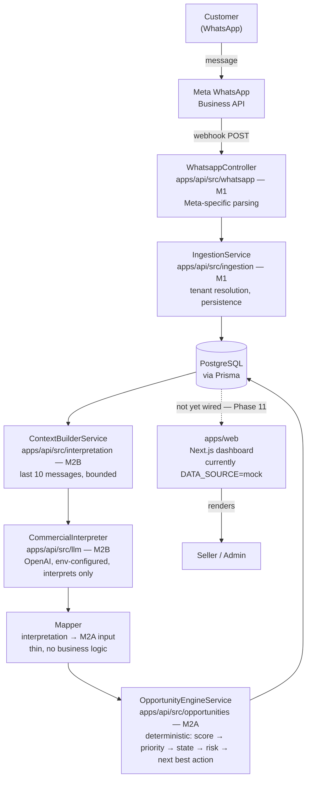

# KEOM — System Overview

KEOM is a B2B control/visibility layer on top of monitored WhatsApp Business
conversations: it detects commercial opportunities that are stalling, prioritizes them,
and recommends the next best action. It is not a chatbot and not a CRM.

This doc is a map, not a spec — it shows how `apps/web` and `apps/api` fit together and
where each piece is documented in depth. For the actual decisions/conventions, go to:

- **Frontend architecture** (decisions, folder structure, route map, phases) →
  [`docs/ARCHITECTURE.md`](./ARCHITECTURE.md)
- **Backend architecture and milestones** (M1 ingestion, M2A deterministic engine, M2B
  LLM interpretation, local setup, testing) → [`apps/api/README.md`](../apps/api/README.md)

---

## End-to-end flow

**Read this loosely, not literally:** `apps/web` is drawn connected to the database
because that's the eventual integration point (Phase 11 in `docs/ARCHITECTURE.md`), but
today it is **not** wired to `apps/api` at all — it runs entirely against
`packages/mocks` fixtures (`DATA_SOURCE=mock`). The dashed line above is deliberate: it
marks work that hasn't happened yet, not a live connection.

## What each piece owns

| Piece | Owns | Lives in |
|---|---|---|
| WhatsApp parsing | Meta payload validation/normalization only | `apps/api/src/whatsapp` |
| Ingestion | Tenant resolution, `RawEvent`/`Customer`/`Conversation`/`Message` persistence | `apps/api/src/ingestion` |
| LLM interpretation | Turning conversation text into structured signals — **interprets, never decides** | `apps/api/src/llm`, `apps/api/src/interpretation` |
| Opportunity engine | Score/priority/state/risk/next-best-action — **fully deterministic, no LLM** | `apps/api/src/opportunities` |
| Dashboard | Seller/admin UI, currently mock-driven | `apps/web` |
| Shared FE↔BE types | Not yet consumed by `apps/api` — see `apps/api/README.md`'s note on this | `packages/contracts` |

## Milestone status

| Milestone | Status | Doc |
|---|---|---|
| M1 — WhatsApp ingestion foundation | Done | `apps/api/README.md` |
| M2A — Deterministic Opportunity Engine | Done | `apps/api/README.md` |
| M2B — LLM Commercial Interpretation Layer | Done | `apps/api/README.md` |
| Phase 11 — wire `apps/web` to real `apps/api` | Not started | `docs/ARCHITECTURE.md` |
| M3 — business knowledge / RAG / pgvector | Not started | — |
| Redis/BullMQ, scheduled reevaluation, notifications, outbound WhatsApp | Not started | — |
