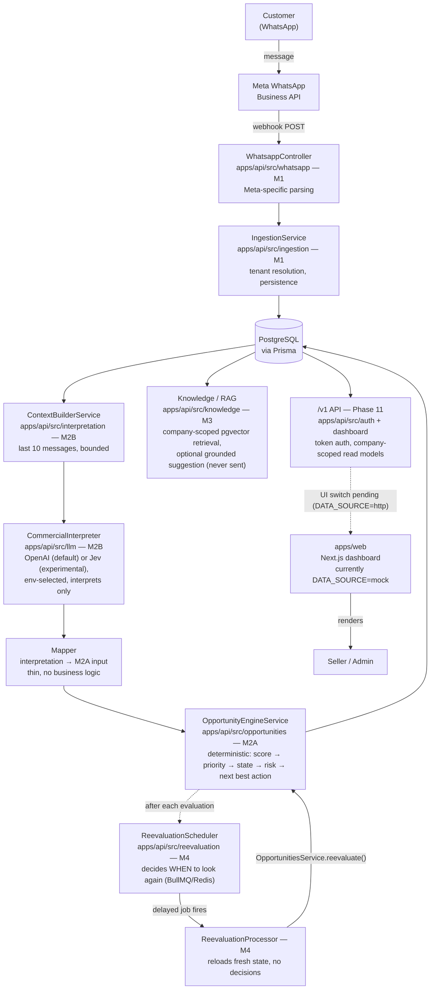

# KEOM — System Overview

KEOM is a B2B control/visibility layer on top of monitored WhatsApp Business
conversations: it detects commercial opportunities that are stalling, prioritizes them,
and recommends the next best action. It is not a chatbot and not a CRM.

This doc is a map, not a spec — it shows how `apps/web` and `apps/api` fit together and
where each piece is documented in depth. For the actual decisions/conventions, go to:

- **Frontend architecture** (decisions, folder structure, route map, phases) →
  [`docs/ARCHITECTURE.md`](./ARCHITECTURE.md)
- **Backend architecture and milestones** (M1 ingestion, M2A deterministic engine, M2B
  LLM interpretation, M3 business knowledge / RAG, M4 temporal re-evaluation, local setup,
  testing) → [`apps/api/README.md`](../apps/api/README.md)

---

## End-to-end flow

```mermaid
flowchart TD
    Customer["Customer<br/>(WhatsApp)"] -->|message| Meta["Meta WhatsApp<br/>Business API"]
    Meta -->|webhook POST| Webhook["WhatsappController<br/>apps/api/src/whatsapp — M1<br/>Meta-specific parsing"]
    Webhook --> Ingestion["IngestionService<br/>apps/api/src/ingestion — M1<br/>tenant resolution, persistence"]
    Ingestion --> DB[("PostgreSQL<br/>via Prisma")]

    DB --> ContextBuilder["ContextBuilderService<br/>apps/api/src/interpretation — M2B<br/>last 10 messages, bounded"]
    ContextBuilder --> LLM["CommercialInterpreter<br/>apps/api/src/llm — M2B<br/>OpenAI (default) or Jev (experimental),<br/>env-selected, interprets only"]
    LLM --> Mapper["Mapper<br/>interpretation → M2A input<br/>thin, no business logic"]
    Mapper --> Engine["OpportunityEngineService<br/>apps/api/src/opportunities — M2A<br/>deterministic: score → priority → state → risk → next best action"]
    Engine --> DB
    Engine -.->|"after each evaluation"| Scheduler["ReevaluationScheduler<br/>apps/api/src/reevaluation — M4<br/>decides WHEN to look again (BullMQ/Redis)"]
    Scheduler -->|"delayed job fires"| Worker["ReevaluationProcessor — M4<br/>reloads fresh state, no decisions"]
    Worker -->|"OpportunitiesService.reevaluate()"| Engine

    DB --> Knowledge["Knowledge / RAG<br/>apps/api/src/knowledge — M3<br/>company-scoped pgvector retrieval,<br/>optional grounded suggestion (never sent)"]

    DB --> V1["/v1 API — Phase 11<br/>apps/api/src/auth + dashboard<br/>token auth, company-scoped read models"]
    V1 -.->|"UI switch pending (DATA_SOURCE=http)"| WebApp["apps/web<br/>Next.js dashboard<br/>currently DATA_SOURCE=mock"]
    WebApp -->|renders| Seller["Seller / Admin"]
```

**Read this loosely, not literally:** the backend side of Phase 11 exists (the `/v1` API,
see `docs/PHASE-11-API.md`), but `apps/web` still runs entirely against `packages/mocks`
fixtures (`DATA_SOURCE=mock`). The dashed line marks the UI switch that hasn't happened yet,
not a live connection.

## What each piece owns

| Piece | Owns | Lives in |
|---|---|---|
| WhatsApp parsing | Meta payload validation/normalization only | `apps/api/src/whatsapp` |
| Ingestion | Tenant resolution, `RawEvent`/`Customer`/`Conversation`/`Message` persistence | `apps/api/src/ingestion` |
| LLM interpretation | Turning conversation text into structured signals — **interprets, never decides** | `apps/api/src/llm`, `apps/api/src/interpretation` |
| Opportunity engine | Score/priority/state/risk/next-best-action — **fully deterministic, no LLM** | `apps/api/src/opportunities` |
| Temporal re-evaluation | **When** to re-check an opportunity (after M2A's stall checkpoints, explicit follow-ups); fires M2A on fresh data — **never decides risk/state itself** | `apps/api/src/reevaluation` |
| Business knowledge (RAG) | Company documents → chunks → embeddings (pgvector), company-scoped retrieval, optional grounded suggestion — **supplies facts, never decides or sends** | `apps/api/src/knowledge` (+ providers in `apps/api/src/llm`) |
| Dashboard API | Users + login, authenticated `/v1` read models shaped as `packages/contracts` (alerts, risk), alert acknowledgement — **company-scoped from the token** | `apps/api/src/auth`, `apps/api/src/dashboard` |
| Dashboard | Seller/admin UI, currently mock-driven (switching to `/v1` is Phase 11, see `docs/PHASE-11-API.md`) | `apps/web` |
| Shared FE↔BE types | `apps/api` e2e tests validate every `/v1` response against them | `packages/contracts` |

## Milestone status

| Milestone | Status | Doc |
|---|---|---|
| M1 — WhatsApp ingestion foundation | Done | `apps/api/README.md` |
| M2A — Deterministic Opportunity Engine | Done | `apps/api/README.md` |
| M2B — LLM Commercial Interpretation Layer | Done | `apps/api/README.md` |
| Phase 11 — wire `apps/web` to real `apps/api` | Backend done (auth, alerts, risk); UI switch pending | `docs/PHASE-11-API.md` |
| M3 — Business Knowledge / RAG (pgvector) | Done | `apps/api/README.md` |
| M4 — Temporal Re-evaluation (BullMQ/Redis) | Done | `apps/api/README.md` |
| M5 notifications / seller approval, M6 outbound WhatsApp | Not started | — |
